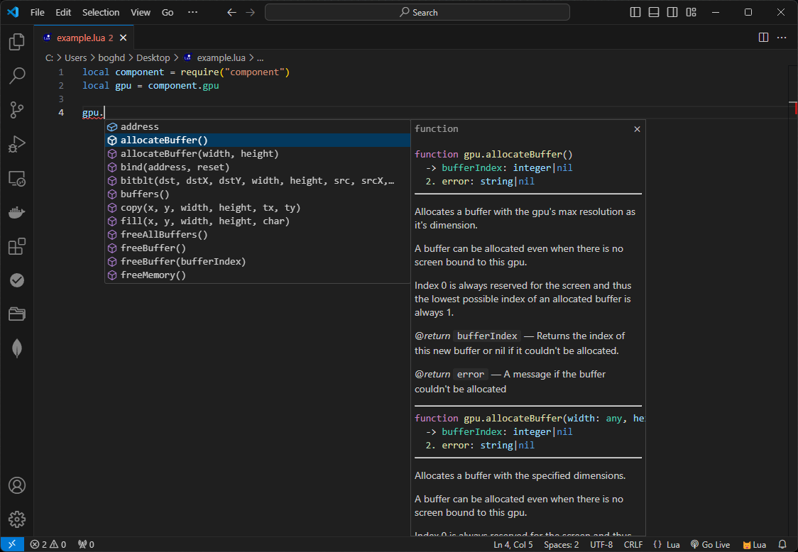
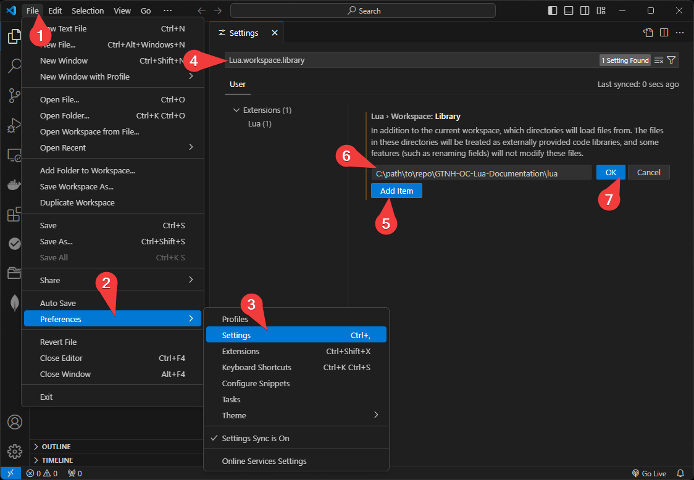
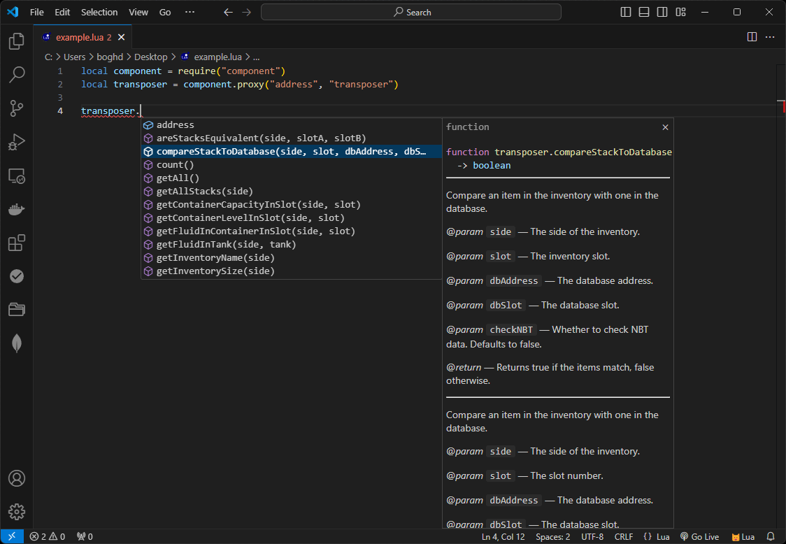

# GTNH-OC-Lua-Documentation

> [!CAUTION]
> The documentation is written for a modified version of [Open Computers](https://github.com/GTNewHorizons/OpenComputers) from GTNH modpack.


## Content
- [Information](#information)
- [How to install](#how-to-install)
- [How to use](#how-to-use)
- [What's already done](#what-already-done)

<a id="information"></a>

## Information

This documentation is written for the VS Code IDE and Lua extension by sumneko. 
It adds autocomplete code and function descriptions of Open Computers components and libraries. 

> [!NOTE]  
> The documentation is written using generative models of artificial intelligence (ChatGPT). So mistakes are not excluded, feel free to write I will correct.



<a id="how-to-install"></a>

## How to install

1. Install extension `Lua by sumneko`: [link](https://marketplace.visualstudio.com/items?itemName=sumneko.lua)
2. Open the VS code settings (<kbd>Ctrl</kbd>+<kbd>,</kbd>).
3. Search for `Lua.workspace.library`.
4. Click `Add Item` and enter the path to `lua` folder in the input.
5. Click OK



<a id="how-to-use"></a>

## How to use

To use it, just import the required library and if there is documentation for it, everything will work automatically.

If you want to use documentation for components, pass the component type as parameter when calling functions:

- For `component.proxy`
  ```lua
  local proxy = component.proxy("address", "type")
  ```

- For `component.getPrimary`
  ```lua
  local proxy = component.getPrimary("type")
  ```

For a list of supported components, see the section [What's already done](#what-already-done-components)



<a id="what-already-done"></a>

## What's already done

At the moment documentation has been written for the following libraries:

- [buffer](https://github.com/Navatusein/GTNH-OC-Lua-Documentation/blob/main/lua/libs/buffer.lua)
- [colors](https://github.com/Navatusein/GTNH-OC-Lua-Documentation/blob/main/lua/libs/colors.lua)
- [component](https://github.com/Navatusein/GTNH-OC-Lua-Documentation/blob/main/lua/libs/component.lua)
- [computer](https://github.com/Navatusein/GTNH-OC-Lua-Documentation/blob/main/lua/libs/computer.lua)
- [event](https://github.com/Navatusein/GTNH-OC-Lua-Documentation/blob/main/lua/libs/event.lua)
- [filesystem](https://github.com/Navatusein/GTNH-OC-Lua-Documentation/blob/main/lua/libs/filesystem.lua)
- [internet](https://github.com/Navatusein/GTNH-OC-Lua-Documentation/blob/main/lua/libs/internet.lua)
- [keyboard](https://github.com/Navatusein/GTNH-OC-Lua-Documentation/blob/main/lua/libs/keyboard.lua)
- [note](https://github.com/Navatusein/GTNH-OC-Lua-Documentation/blob/main/lua/libs/note.lua)
- [os](https://github.com/Navatusein/GTNH-OC-Lua-Documentation/blob/main/lua/libs/os.lua)
- [process](https://github.com/Navatusein/GTNH-OC-Lua-Documentation/blob/main/lua/libs/process.lua)
- [robot](https://github.com/Navatusein/GTNH-OC-Lua-Documentation/blob/main/lua/libs/robot.lua)
- [serialization](https://github.com/Navatusein/GTNH-OC-Lua-Documentation/blob/main/lua/libs/serialization.lua)
- [shell](https://github.com/Navatusein/GTNH-OC-Lua-Documentation/blob/main/lua/libs/shell.lua)
- [sides](https://github.com/Navatusein/GTNH-OC-Lua-Documentation/blob/main/lua/libs/sides.lua)
- [term](https://github.com/Navatusein/GTNH-OC-Lua-Documentation/blob/main/lua/libs/term.lua)
- [text](https://github.com/Navatusein/GTNH-OC-Lua-Documentation/blob/main/lua/libs/text.lua)
- [thread](https://github.com/Navatusein/GTNH-OC-Lua-Documentation/blob/main/lua/libs/thread.lua)
- [unicode](https://github.com/Navatusein/GTNH-OC-Lua-Documentation/blob/main/lua/libs/unicode.lua)
- [uuid](https://github.com/Navatusein/GTNH-OC-Lua-Documentation/blob/main/lua/libs/uuid.lua)

<a id="what-already-done-components"></a>

Documentation is also ready for the following components:

- [aemultipart](https://github.com/Navatusein/GTNH-OC-Lua-Documentation/blob/main/lua/components/ae-multipart.lua)
- [beekeeper](https://github.com/Navatusein/GTNH-OC-Lua-Documentation/blob/main/lua/components/beekeeper.lua)
- [blood_altar](https://github.com/Navatusein/GTNH-OC-Lua-Documentation/blob/main/lua/components/blood-altar.lua)
- [camera](https://github.com/Navatusein/GTNH-OC-Lua-Documentation/blob/main/lua/components/camera.lua)
- [chat_box](https://github.com/Navatusein/GTNH-OC-Lua-Documentation/blob/main/lua/components/chat-box.lua)
- [database](https://github.com/Navatusein/GTNH-OC-Lua-Documentation/blob/main/lua/components/database.lua)
- [debug](https://github.com/Navatusein/GTNH-OC-Lua-Documentation/blob/main/lua/components/debug.lua)
- [geolyzer](https://github.com/Navatusein/GTNH-OC-Lua-Documentation/blob/main/lua/components/geolyzer.lua)
- [glasses](https://github.com/Navatusein/GTNH-OC-Lua-Documentation/blob/main/lua/components/glasses.lua)
- [gpu](https://github.com/Navatusein/GTNH-OC-Lua-Documentation/blob/main/lua/components/gpu.lua)
- [gt_machine](https://github.com/Navatusein/GTNH-OC-Lua-Documentation/blob/main/lua/components/gt-machine.lua)
- [info_panel](https://github.com/Navatusein/GTNH-OC-Lua-Documentation/blob/main/lua/components/info-panel.lua)
- [inventory_controller](https://github.com/Navatusein/GTNH-OC-Lua-Documentation/blob/main/lua/components/inventory-controller.lua)
- [level_maintainer](https://github.com/Navatusein/GTNH-OC-Lua-Documentation/blob/main/lua/components/level-maintainer.lua)
- [master_ritual_stone](https://github.com/Navatusein/GTNH-OC-Lua-Documentation/blob/main/lua/components/master-ritual-stone.lua)
- [me_controller](https://github.com/Navatusein/GTNH-OC-Lua-Documentation/blob/main/lua/components/me-controller.lua)
- [me_exportbus](https://github.com/Navatusein/GTNH-OC-Lua-Documentation/blob/main/lua/components/me-exportbus.lua)
- [me_interface](https://github.com/Navatusein/GTNH-OC-Lua-Documentation/blob/main/lua/components/me-interface.lua)
- [modem](https://github.com/Navatusein/GTNH-OC-Lua-Documentation/blob/main/lua/components/modem.lua)
- [motion_sensor](https://github.com/Navatusein/GTNH-OC-Lua-Documentation/blob/main/lua/components/motion-sensor.lua)
- [printer3d](https://github.com/Navatusein/GTNH-OC-Lua-Documentation/blob/main/lua/components/printer3d.lua)
- [reactor](https://github.com/Navatusein/GTNH-OC-Lua-Documentation/blob/main/lua/components/reactor.lua)
- [reactor_chamber](https://github.com/Navatusein/GTNH-OC-Lua-Documentation/blob/main/lua/components/reactor-chamber.lua)
- [reactor_redstone_port](https://github.com/Navatusein/GTNH-OC-Lua-Documentation/blob/main/lua/components/reactor-redstone-port.lua)
- [redstone](https://github.com/Navatusein/GTNH-OC-Lua-Documentation/blob/main/lua/components/redstone.lua)
- [robot](https://github.com/Navatusein/GTNH-OC-Lua-Documentation/blob/main/lua/components/robot.lua)
- [screen](https://github.com/Navatusein/GTNH-OC-Lua-Documentation/blob/main/lua/components/screen.lua)
- [sign](https://github.com/Navatusein/GTNH-OC-Lua-Documentation/blob/main/lua/components/sign.lua)
- [tank_controller](https://github.com/Navatusein/GTNH-OC-Lua-Documentation/blob/main/lua/components/tank-controller.lua)
- [tilechest](https://github.com/Navatusein/GTNH-OC-Lua-Documentation/blob/main/lua/components/tilechest.lua)
- [tps_card](https://github.com/Navatusein/GTNH-OC-Lua-Documentation/blob/main/lua/components/tps-card.lua)
- [transposer](https://github.com/Navatusein/GTNH-OC-Lua-Documentation/blob/main/lua/components/transposer.lua)
- [upgrade_me](https://github.com/Navatusein/GTNH-OC-Lua-Documentation/blob/main/lua/components/upgrade-me.lua)
- [waypoint](https://github.com/Navatusein/GTNH-OC-Lua-Documentation/blob/main/lua/components/waypoint.lua)
- [world_sensor](https://github.com/Navatusein/GTNH-OC-Lua-Documentation/blob/main/lua/components/world-sensor.lua)
