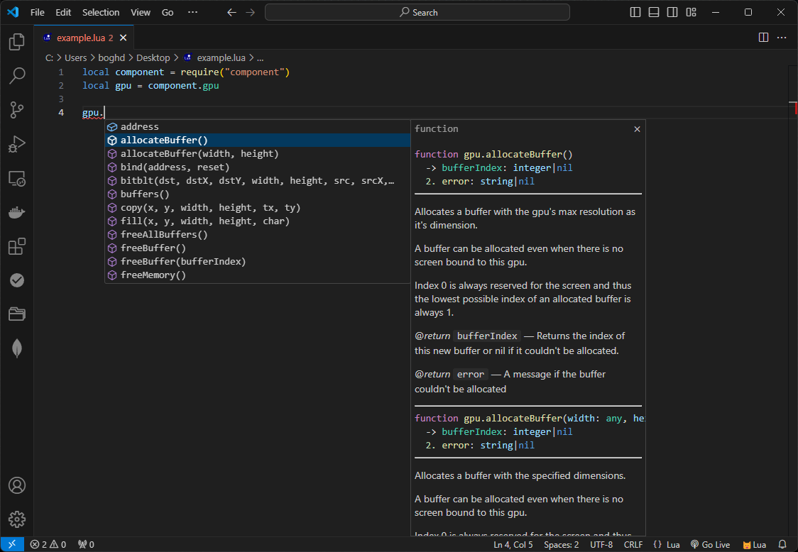
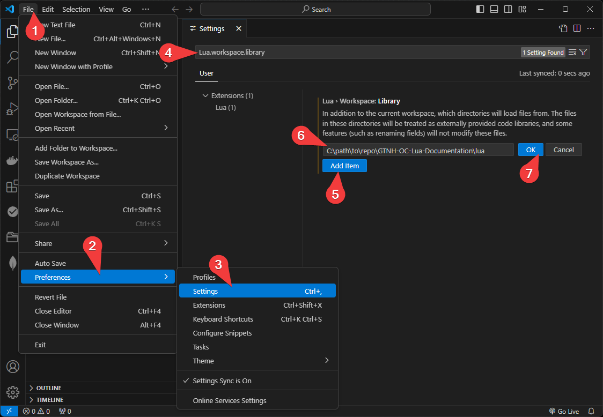
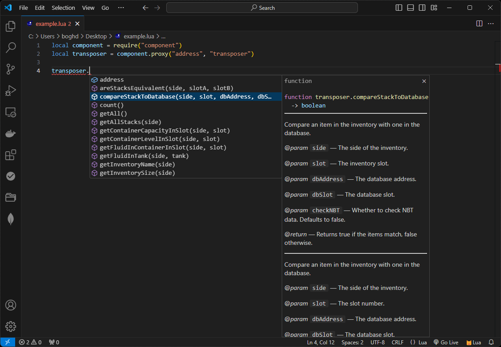

# GTNH-OC-Lua-Documentation

> [!CAUTION]
> The documentation is written for a modified version of [Open Computers](https://github.com/GTNewHorizons/OpenComputers) from GTNH modpack.


## Content
- [Information](#information)
- [How to install](#how-to-install)
- [How to use](#how-to-use)
- [What's already done](#what-already-done)

<a id="information"></a>

## Information

This documentation is written for the VS Code IDE and Lua extension by sumneko. 
It adds autocomplete code and function descriptions of Open Computers components and libraries. 

> [!NOTE]  
> The documentation is written using generative models of artificial intelligence (ChatGPT). So mistakes are not excluded, feel free to write I will correct.



<a id="how-to-install"></a>

## How to install

1. Install extension `Lua by sumneko`: [link](https://marketplace.visualstudio.com/items?itemName=sumneko.lua)
2. Open the VS code settings (<kbd>Ctrl</kbd>+<kbd>,</kbd>).
3. Search for `Lua.workspace.library`.
4. Click `Add Item` and enter the path to `lua` folder in the input.
5. Click OK



<a id="how-to-use"></a>

## How to use

To use it, just import the required library and if there is documentation for it, everything will work automatically.

If you want to use documentation for components, pass the component type as parameter when calling functions:

- For `component.proxy`
  ```lua
  local proxy = component.proxy("address", "type")
  ```

- For `component.getPrimary`
  ```lua
  local proxy = component.getPrimary("type")
  ```

For a list of supported components, see the section [What's already done](#what-already-done-components)



<a id="what-already-done"></a>

## What's already done

Documentation is ready for these 28 libraries.

#### What a script reaches for

| Library | What it is for |
| --- | --- |
| [`component`](https://github.com/Navatusein/GTNH-OC-Lua-Documentation/blob/main/lua/libs/component.lua) | the components attached to this machine |
| [`computer`](https://github.com/Navatusein/GTNH-OC-Lua-Documentation/blob/main/lua/libs/computer.lua) | the machine itself: energy, uptime, signals, shutdown |
| [`event`](https://github.com/Navatusein/GTNH-OC-Lua-Documentation/blob/main/lua/libs/event.lua) | waiting for and reacting to signals |
| [`filesystem`](https://github.com/Navatusein/GTNH-OC-Lua-Documentation/blob/main/lua/libs/filesystem.lua) | files and directories, mounts and paths |
| [`io`](https://github.com/Navatusein/GTNH-OC-Lua-Documentation/blob/main/lua/libs/io.lua) | opening files and the standard streams |
| [`term`](https://github.com/Navatusein/GTNH-OC-Lua-Documentation/blob/main/lua/libs/term.lua) | reading and writing on the terminal |
| [`text`](https://github.com/Navatusein/GTNH-OC-Lua-Documentation/blob/main/lua/libs/text.lua) | trimming, padding, wrapping and tokenizing strings |
| [`unicode`](https://github.com/Navatusein/GTNH-OC-Lua-Documentation/blob/main/lua/libs/unicode.lua) | string functions that count characters, not bytes |
| [`serialization`](https://github.com/Navatusein/GTNH-OC-Lua-Documentation/blob/main/lua/libs/serialization.lua) | turning tables into text and back |
| [`os`](https://github.com/Navatusein/GTNH-OC-Lua-Documentation/blob/main/lua/libs/os.lua) | time, environment variables, sleeping, running commands |
| [`shell`](https://github.com/Navatusein/GTNH-OC-Lua-Documentation/blob/main/lua/libs/shell.lua) | the working directory, aliases, resolving and running programs |
| [`internet`](https://github.com/Navatusein/GTNH-OC-Lua-Documentation/blob/main/lua/libs/internet.lua) | HTTP requests and TCP sockets |
| [`thread`](https://github.com/Navatusein/GTNH-OC-Lua-Documentation/blob/main/lua/libs/thread.lua) | running several things at once |
| [`keyboard`](https://github.com/Navatusein/GTNH-OC-Lua-Documentation/blob/main/lua/libs/keyboard.lua) | key codes and which keys are held down |
| [`colors`](https://github.com/Navatusein/GTNH-OC-Lua-Documentation/blob/main/lua/libs/colors.lua) | the sixteen dye colours by name |
| [`sides`](https://github.com/Navatusein/GTNH-OC-Lua-Documentation/blob/main/lua/libs/sides.lua) | the six sides by name, and their opposites |
| [`note`](https://github.com/Navatusein/GTNH-OC-Lua-Documentation/blob/main/lua/libs/note.lua) | note block pitches by name and frequency |
| [`uuid`](https://github.com/Navatusein/GTNH-OC-Lua-Documentation/blob/main/lua/libs/uuid.lua) | generating a random address |
| [`robot`](https://github.com/Navatusein/GTNH-OC-Lua-Documentation/blob/main/lua/libs/robot.lua) | moving, turning and interacting, for a robot |
| [`bit32`](https://github.com/Navatusein/GTNH-OC-Lua-Documentation/blob/main/lua/libs/bit32.lua) | bitwise operations on 32 bit integers |
| [`nbt`](https://github.com/Navatusein/GTNH-OC-Lua-Documentation/blob/main/lua/libs/nbt.lua) | reading the NBT trees of a Data Card as plain tables |
| [`buffer`](https://github.com/Navatusein/GTNH-OC-Lua-Documentation/blob/main/lua/libs/buffer.lua) | the buffered stream that `io.open` returns |

#### Lower level, mostly used by the system

| Library | What it is for |
| --- | --- |
| [`tty`](https://github.com/Navatusein/GTNH-OC-Lua-Documentation/blob/main/lua/libs/tty.lua) | the terminal device `term` is built on and inherits from |
| [`process`](https://github.com/Navatusein/GTNH-OC-Lua-Documentation/blob/main/lua/libs/process.lua) | the process table, environments and handles |
| [`package`](https://github.com/Navatusein/GTNH-OC-Lua-Documentation/blob/main/lua/libs/package.lua) | module loading, that is what stands behind `require` |
| [`devfs`](https://github.com/Navatusein/GTNH-OC-Lua-Documentation/blob/main/lua/libs/devfs.lua) | the `/dev` file system, where components appear as files |
| [`vt100`](https://github.com/Navatusein/GTNH-OC-Lua-Documentation/blob/main/lua/libs/vt100.lua) | the ANSI escape sequences the terminal understands |
| [`transforms`](https://github.com/Navatusein/GTNH-OC-Lua-Documentation/blob/main/lua/libs/transforms.lua) | range helpers for tables, used while parsing command lines |

<a id="what-already-done-components"></a>

Documentation is ready for the following 165 components, grouped by the mod that
provides them. Some names look odd — `caninv`, `blockjar_0`, `tile_for_apiculture_0_name` —
because OpenComputers derives a component name from the block itself whenever no driver
declares one. Those are the names the game really answers to.

[OpenComputers — cards](#opencomputers--cards) (13) · [OpenComputers — upgrades](#opencomputers--upgrades) (18) · [OpenComputers — blocks and machines](#opencomputers--blocks-and-machines) (14) · [Applied Energistics 2](#applied-energistics-2) (10) · [AE2 Fluid Craft Rework](#ae2-fluid-craft-rework) (6) · [Thaumic Energistics](#thaumic-energistics) (4) · [GregTech](#gregtech) (6) · [Computronics](#computronics) (16) · [OpenSecurity](#opensecurity) (10) · [Forestry and Magic Bees](#forestry-and-magic-bees) (13) · [Thaumcraft](#thaumcraft) (6) · [IndustrialCraft 2](#industrialcraft-2) (3) · [Railcraft](#railcraft) (5) · [Open Modular Turrets](#open-modular-turrets) (10) · [Draconic Evolution](#draconic-evolution) (15) · [Other mods](#other-mods) (10) · [Vanilla blocks, through an adapter](#vanilla-blocks-through-an-adapter) (6)

#### OpenComputers — cards

| Component | What it is |
| --- | --- |
| [`data`](https://github.com/Navatusein/GTNH-OC-Lua-Documentation/blob/main/lua/components/data.lua) | Data Card |
| [`debug`](https://github.com/Navatusein/GTNH-OC-Lua-Documentation/blob/main/lua/components/debug.lua) | Debug Card, creative only |
| [`drive`](https://github.com/Navatusein/GTNH-OC-Lua-Documentation/blob/main/lua/components/drive.lua) | hard drive in unmanaged mode |
| [`eeprom`](https://github.com/Navatusein/GTNH-OC-Lua-Documentation/blob/main/lua/components/eeprom.lua) | EEPROM |
| [`filesystem`](https://github.com/Navatusein/GTNH-OC-Lua-Documentation/blob/main/lua/components/filesystem.lua) | hard drive, floppy or RAID in managed mode |
| [`gpu`](https://github.com/Navatusein/GTNH-OC-Lua-Documentation/blob/main/lua/components/gpu.lua) | Graphics Card |
| [`internet`](https://github.com/Navatusein/GTNH-OC-Lua-Documentation/blob/main/lua/components/internet.lua) | Internet Card |
| [`keyboard`](https://github.com/Navatusein/GTNH-OC-Lua-Documentation/blob/main/lua/components/keyboard.lua) | Keyboard, no methods of its own |
| [`modem`](https://github.com/Navatusein/GTNH-OC-Lua-Documentation/blob/main/lua/components/modem.lua) | Network Card and Wireless Network Card |
| [`redstone`](https://github.com/Navatusein/GTNH-OC-Lua-Documentation/blob/main/lua/components/redstone.lua) | Redstone Card, in both the plain and the wireless variant |
| [`tps_card`](https://github.com/Navatusein/GTNH-OC-Lua-Documentation/blob/main/lua/components/tps-card.lua) | TPS Card |
| [`tunnel`](https://github.com/Navatusein/GTNH-OC-Lua-Documentation/blob/main/lua/components/tunnel.lua) | Linked Card |
| [`world_sensor`](https://github.com/Navatusein/GTNH-OC-Lua-Documentation/blob/main/lua/components/world-sensor.lua) | World Sensor Card |

#### OpenComputers — upgrades

| Component | What it is |
| --- | --- |
| [`angel`](https://github.com/Navatusein/GTNH-OC-Lua-Documentation/blob/main/lua/components/angel.lua) | Angel Upgrade, no methods of its own |
| [`barcode_reader`](https://github.com/Navatusein/GTNH-OC-Lua-Documentation/blob/main/lua/components/barcode-reader.lua) | Barcode Reader Upgrade, no methods of its own |
| [`chunkloader`](https://github.com/Navatusein/GTNH-OC-Lua-Documentation/blob/main/lua/components/chunkloader.lua) | Chunkloader Upgrade |
| [`configurator`](https://github.com/Navatusein/GTNH-OC-Lua-Documentation/blob/main/lua/components/configurator.lua) | Configurator Upgrade, which edits EnderIO conduits |
| [`crafting`](https://github.com/Navatusein/GTNH-OC-Lua-Documentation/blob/main/lua/components/crafting.lua) | Crafting Upgrade |
| [`database`](https://github.com/Navatusein/GTNH-OC-Lua-Documentation/blob/main/lua/components/database.lua) | Database Upgrade |
| [`experience`](https://github.com/Navatusein/GTNH-OC-Lua-Documentation/blob/main/lua/components/experience.lua) | Experience Upgrade |
| [`generator`](https://github.com/Navatusein/GTNH-OC-Lua-Documentation/blob/main/lua/components/generator.lua) | Generator Upgrade |
| [`geolyzer`](https://github.com/Navatusein/GTNH-OC-Lua-Documentation/blob/main/lua/components/geolyzer.lua) | Geolyzer |
| [`inventory_controller`](https://github.com/Navatusein/GTNH-OC-Lua-Documentation/blob/main/lua/components/inventory-controller.lua) | Inventory Controller Upgrade |
| [`leash`](https://github.com/Navatusein/GTNH-OC-Lua-Documentation/blob/main/lua/components/leash.lua) | Leash Upgrade |
| [`motion_sensor`](https://github.com/Navatusein/GTNH-OC-Lua-Documentation/blob/main/lua/components/motion-sensor.lua) | Motion Sensor |
| [`navigation`](https://github.com/Navatusein/GTNH-OC-Lua-Documentation/blob/main/lua/components/navigation.lua) | Navigation Upgrade |
| [`piston`](https://github.com/Navatusein/GTNH-OC-Lua-Documentation/blob/main/lua/components/piston.lua) | Piston Upgrade |
| [`sign`](https://github.com/Navatusein/GTNH-OC-Lua-Documentation/blob/main/lua/components/sign.lua) | Sign Upgrade |
| [`tank_controller`](https://github.com/Navatusein/GTNH-OC-Lua-Documentation/blob/main/lua/components/tank-controller.lua) | Tank Controller Upgrade |
| [`tractor_beam`](https://github.com/Navatusein/GTNH-OC-Lua-Documentation/blob/main/lua/components/tractor-beam.lua) | Tractor Beam Upgrade |
| [`trading`](https://github.com/Navatusein/GTNH-OC-Lua-Documentation/blob/main/lua/components/trading.lua) | Trading Upgrade |

#### OpenComputers — blocks and machines

| Component | What it is |
| --- | --- |
| [`assembler`](https://github.com/Navatusein/GTNH-OC-Lua-Documentation/blob/main/lua/components/assembler.lua) | Assembler |
| [`computer`](https://github.com/Navatusein/GTNH-OC-Lua-Documentation/blob/main/lua/components/computer.lua) | a computer case or a robot, seen from another machine |
| [`disk_drive`](https://github.com/Navatusein/GTNH-OC-Lua-Documentation/blob/main/lua/components/disk-drive.lua) | Disk Drive block and the server rack mountable |
| [`drone`](https://github.com/Navatusein/GTNH-OC-Lua-Documentation/blob/main/lua/components/drone.lua) | the drone |
| [`hologram`](https://github.com/Navatusein/GTNH-OC-Lua-Documentation/blob/main/lua/components/hologram.lua) | Hologram Projector |
| [`microcontroller`](https://github.com/Navatusein/GTNH-OC-Lua-Documentation/blob/main/lua/components/microcontroller.lua) | a microcontroller, seen from another machine |
| [`net_splitter`](https://github.com/Navatusein/GTNH-OC-Lua-Documentation/blob/main/lua/components/net-splitter.lua) | Net Splitter |
| [`printer3d`](https://github.com/Navatusein/GTNH-OC-Lua-Documentation/blob/main/lua/components/printer3d.lua) | 3D Printer |
| [`relay`](https://github.com/Navatusein/GTNH-OC-Lua-Documentation/blob/main/lua/components/relay.lua) | Relay and Access Point |
| [`robot`](https://github.com/Navatusein/GTNH-OC-Lua-Documentation/blob/main/lua/components/robot.lua) | the robot, from inside and through an adapter |
| [`screen`](https://github.com/Navatusein/GTNH-OC-Lua-Documentation/blob/main/lua/components/screen.lua) | Screen, all three tiers |
| [`tablet`](https://github.com/Navatusein/GTNH-OC-Lua-Documentation/blob/main/lua/components/tablet.lua) | the tablet, from the program running on it |
| [`transposer`](https://github.com/Navatusein/GTNH-OC-Lua-Documentation/blob/main/lua/components/transposer.lua) | Transposer |
| [`waypoint`](https://github.com/Navatusein/GTNH-OC-Lua-Documentation/blob/main/lua/components/waypoint.lua) | Waypoint |

#### Applied Energistics 2

| Component | What it is |
| --- | --- |
| [`aemultipart`](https://github.com/Navatusein/GTNH-OC-Lua-Documentation/blob/main/lua/components/ae-multipart.lua) | a cable bus, that is any block with AE2 parts on it |
| [`me_cellworkbench`](https://github.com/Navatusein/GTNH-OC-Lua-Documentation/blob/main/lua/components/me-cellworkbench.lua) | ME Cell Workbench |
| [`me_controller`](https://github.com/Navatusein/GTNH-OC-Lua-Documentation/blob/main/lua/components/me-controller.lua) | ME Controller |
| [`me_exportbus`](https://github.com/Navatusein/GTNH-OC-Lua-Documentation/blob/main/lua/components/me-exportbus.lua) | ME Export Bus |
| [`me_importbus`](https://github.com/Navatusein/GTNH-OC-Lua-Documentation/blob/main/lua/components/me-importbus.lua) | ME Import Bus |
| [`me_interface`](https://github.com/Navatusein/GTNH-OC-Lua-Documentation/blob/main/lua/components/me-interface.lua) | ME Interface, block and cable part |
| [`me_interface_terminal`](https://github.com/Navatusein/GTNH-OC-Lua-Documentation/blob/main/lua/components/me-interface-terminal.lua) | ME Interface Terminal |
| [`me_storagebus`](https://github.com/Navatusein/GTNH-OC-Lua-Documentation/blob/main/lua/components/me-storagebus.lua) | ME Storage Bus |
| [`tilechest`](https://github.com/Navatusein/GTNH-OC-Lua-Documentation/blob/main/lua/components/tile-chest.lua) | ME Chest |
| [`upgrade_me`](https://github.com/Navatusein/GTNH-OC-Lua-Documentation/blob/main/lua/components/upgrade-me.lua) | ME Upgrade for a robot or a drone |

#### AE2 Fluid Craft Rework

| Component | What it is |
| --- | --- |
| [`fluid_exportbus`](https://github.com/Navatusein/GTNH-OC-Lua-Documentation/blob/main/lua/components/fluid-exportbus.lua) | ME Fluid Export Bus |
| [`fluid_importbus`](https://github.com/Navatusein/GTNH-OC-Lua-Documentation/blob/main/lua/components/fluid-importbus.lua) | ME Fluid Import Bus |
| [`fluid_interface`](https://github.com/Navatusein/GTNH-OC-Lua-Documentation/blob/main/lua/components/me-fluid-interface.lua) | ME Fluid Interface, block and cable part |
| [`fluid_storagebus`](https://github.com/Navatusein/GTNH-OC-Lua-Documentation/blob/main/lua/components/fluid-storagebus.lua) | ME Fluid Storage Bus |
| [`level_maintainer`](https://github.com/Navatusein/GTNH-OC-Lua-Documentation/blob/main/lua/components/level-maintainer.lua) | Level Maintainer |
| [`oc_pattern_editor`](https://github.com/Navatusein/GTNH-OC-Lua-Documentation/blob/main/lua/components/oc-pattern-editor.lua) | OC Pattern Editor |

#### Thaumic Energistics

| Component | What it is |
| --- | --- |
| [`essentia_exportbus`](https://github.com/Navatusein/GTNH-OC-Lua-Documentation/blob/main/lua/components/essentia-exportbus.lua) | ME Essentia Export Bus |
| [`essentia_importbus`](https://github.com/Navatusein/GTNH-OC-Lua-Documentation/blob/main/lua/components/essentia-importbus.lua) | ME Essentia Import Bus |
| [`essentia_storagebus`](https://github.com/Navatusein/GTNH-OC-Lua-Documentation/blob/main/lua/components/essentia-storagebus.lua) | ME Essentia Storage Bus |
| [`thaumicenergistics_block_essentia_vibration_chamber`](https://github.com/Navatusein/GTNH-OC-Lua-Documentation/blob/main/lua/components/thaumicenergistics-essentia-vibration-chamber.lua) | Essentia Vibration Chamber |

#### GregTech

| Component | What it is |
| --- | --- |
| [`bec_diode`](https://github.com/Navatusein/GTNH-OC-Lua-Documentation/blob/main/lua/components/bec-diode.lua) | Bartworks Energy Cluster diode |
| [`bec_io_node`](https://github.com/Navatusein/GTNH-OC-Lua-Documentation/blob/main/lua/components/bec-io-node.lua) | Bartworks Energy Cluster IO node |
| [`bec_storage`](https://github.com/Navatusein/GTNH-OC-Lua-Documentation/blob/main/lua/components/bec-storage.lua) | Bartworks Energy Cluster storage block |
| [`gt_batterybuffer`](https://github.com/Navatusein/GTNH-OC-Lua-Documentation/blob/main/lua/components/gt-batterybuffer.lua) | Battery Buffer |
| [`gt_energycontainer`](https://github.com/Navatusein/GTNH-OC-Lua-Documentation/blob/main/lua/components/gt-energycontainer.lua) | a block that only stores EU, such as a battery box |
| [`gt_machine`](https://github.com/Navatusein/GTNH-OC-Lua-Documentation/blob/main/lua/components/gt-machine.lua) | any GregTech machine: progress, energy, circuit configuration |

#### Computronics

| Component | What it is |
| --- | --- |
| [`advanced_cipher`](https://github.com/Navatusein/GTNH-OC-Lua-Documentation/blob/main/lua/components/advanced-cipher.lua) | Advanced Cipher Block |
| [`beep`](https://github.com/Navatusein/GTNH-OC-Lua-Documentation/blob/main/lua/components/beep.lua) | Beep Card |
| [`camera`](https://github.com/Navatusein/GTNH-OC-Lua-Documentation/blob/main/lua/components/camera.lua) | Camera |
| [`chat_box`](https://github.com/Navatusein/GTNH-OC-Lua-Documentation/blob/main/lua/components/chat-box.lua) | Chat Box |
| [`cipher`](https://github.com/Navatusein/GTNH-OC-Lua-Documentation/blob/main/lua/components/cipher.lua) | Cipher Block |
| [`colorful_lamp`](https://github.com/Navatusein/GTNH-OC-Lua-Documentation/blob/main/lua/components/colorful-lamp.lua) | Colorful Lamp |
| [`colors`](https://github.com/Navatusein/GTNH-OC-Lua-Documentation/blob/main/lua/components/colors.lua) | Colorful Upgrade for a robot or a drone |
| [`iron_noteblock`](https://github.com/Navatusein/GTNH-OC-Lua-Documentation/blob/main/lua/components/iron-noteblock.lua) | Iron Note Block |
| [`noise`](https://github.com/Navatusein/GTNH-OC-Lua-Documentation/blob/main/lua/components/noise.lua) | Noise Card |
| [`particle`](https://github.com/Navatusein/GTNH-OC-Lua-Documentation/blob/main/lua/components/particle.lua) | Particle Card |
| [`radar`](https://github.com/Navatusein/GTNH-OC-Lua-Documentation/blob/main/lua/components/radar.lua) | Radar |
| [`self_destruct`](https://github.com/Navatusein/GTNH-OC-Lua-Documentation/blob/main/lua/components/self-destruct.lua) | Self Destruct Card |
| [`sound`](https://github.com/Navatusein/GTNH-OC-Lua-Documentation/blob/main/lua/components/sound.lua) | Sound Card |
| [`speech`](https://github.com/Navatusein/GTNH-OC-Lua-Documentation/blob/main/lua/components/speech.lua) | Speech Upgrade for a robot or a drone |
| [`speech_box`](https://github.com/Navatusein/GTNH-OC-Lua-Documentation/blob/main/lua/components/speech-box.lua) | Speech Box block |
| [`tape_drive`](https://github.com/Navatusein/GTNH-OC-Lua-Documentation/blob/main/lua/components/tape-drive.lua) | Tape Drive |

#### OpenSecurity

| Component | What it is |
| --- | --- |
| [`os_alarm`](https://github.com/Navatusein/GTNH-OC-Lua-Documentation/blob/main/lua/components/os-alarm.lua) | Alarm |
| [`os_biometric`](https://github.com/Navatusein/GTNH-OC-Lua-Documentation/blob/main/lua/components/os-biometric.lua) | Biometric Reader |
| [`os_cardwriter`](https://github.com/Navatusein/GTNH-OC-Lua-Documentation/blob/main/lua/components/os-cardwriter.lua) | Card Writer |
| [`os_datablock`](https://github.com/Navatusein/GTNH-OC-Lua-Documentation/blob/main/lua/components/os-datablock.lua) | Data Block |
| [`os_door`](https://github.com/Navatusein/GTNH-OC-Lua-Documentation/blob/main/lua/components/os-door.lua) | door controller |
| [`os_energyturret`](https://github.com/Navatusein/GTNH-OC-Lua-Documentation/blob/main/lua/components/os-energyturret.lua) | Energy Turret |
| [`os_entdetector`](https://github.com/Navatusein/GTNH-OC-Lua-Documentation/blob/main/lua/components/os-entdetector.lua) | Entity Detector |
| [`os_keypad`](https://github.com/Navatusein/GTNH-OC-Lua-Documentation/blob/main/lua/components/os-keypad.lua) | Keypad |
| [`os_magreader`](https://github.com/Navatusein/GTNH-OC-Lua-Documentation/blob/main/lua/components/os-magreader.lua) | Magnetic Card Reader |
| [`os_rfidreader`](https://github.com/Navatusein/GTNH-OC-Lua-Documentation/blob/main/lua/components/os-rfidreader.lua) | RFID Reader |

#### Forestry and Magic Bees

| Component | What it is |
| --- | --- |
| [`alveary`](https://github.com/Navatusein/GTNH-OC-Lua-Documentation/blob/main/lua/components/alveary.lua) | an energised alveary |
| [`beekeeper`](https://github.com/Navatusein/GTNH-OC-Lua-Documentation/blob/main/lua/components/beekeeper.lua) | Beekeeper Upgrade for a robot or a drone |
| [`caninv`](https://github.com/Navatusein/GTNH-OC-Lua-Documentation/blob/main/lua/components/caninv.lua) | a bee housing, named after its inventory |
| [`for_alveary_0`](https://github.com/Navatusein/GTNH-OC-Lua-Documentation/blob/main/lua/components/for-alveary-0.lua) | an alveary block |
| [`for_alveary_3`](https://github.com/Navatusein/GTNH-OC-Lua-Documentation/blob/main/lua/components/for-alveary-3.lua) | an energised alveary block |
| [`for_alveary_4`](https://github.com/Navatusein/GTNH-OC-Lua-Documentation/blob/main/lua/components/for-alveary-4.lua) | an energised alveary block |
| [`for_alveary_6`](https://github.com/Navatusein/GTNH-OC-Lua-Documentation/blob/main/lua/components/for-alveary-6.lua) | an alveary block |
| [`forestry_analyzer`](https://github.com/Navatusein/GTNH-OC-Lua-Documentation/blob/main/lua/components/forestry-analyzer.lua) | Analyzer |
| [`items`](https://github.com/Navatusein/GTNH-OC-Lua-Documentation/blob/main/lua/components/items.lua) | a bee housing, named after its inventory |
| [`magicbees_magicapiary`](https://github.com/Navatusein/GTNH-OC-Lua-Documentation/blob/main/lua/components/magicbees-magicapiary.lua) | Magic Apiary from Magic Bees |
| [`swarminv`](https://github.com/Navatusein/GTNH-OC-Lua-Documentation/blob/main/lua/components/swarminv.lua) | a bee housing, named after its inventory |
| [`tile_for_apiculture_0_name`](https://github.com/Navatusein/GTNH-OC-Lua-Documentation/blob/main/lua/components/tile-for-apiculture.lua) | an apiary or bee house |
| [`tile_for_apiculture_2_name`](https://github.com/Navatusein/GTNH-OC-Lua-Documentation/blob/main/lua/components/tile-for-apiculture-2.lua) | an apiculture block |

#### Thaumcraft

| Component | What it is |
| --- | --- |
| [`arcane_crafting`](https://github.com/Navatusein/GTNH-OC-Lua-Documentation/blob/main/lua/components/arcane-crafting.lua) | Arcane Crafting Upgrade for a robot or a drone |
| [`blockessentiareservoir`](https://github.com/Navatusein/GTNH-OC-Lua-Documentation/blob/main/lua/components/blockessentiareservoir.lua) | Essentia Reservoir |
| [`blockjar_0`](https://github.com/Navatusein/GTNH-OC-Lua-Documentation/blob/main/lua/components/blockjar-0.lua) | a jar |
| [`blockmetaldevice_0`](https://github.com/Navatusein/GTNH-OC-Lua-Documentation/blob/main/lua/components/blockmetaldevice-0.lua) | a metal device that only stores essentia |
| [`blockmetaldevice_1`](https://github.com/Navatusein/GTNH-OC-Lua-Documentation/blob/main/lua/components/blockmetaldevice-1.lua) | a metal device that moves essentia, alembic or centrifuge |
| [`infusion_matrix`](https://github.com/Navatusein/GTNH-OC-Lua-Documentation/blob/main/lua/components/infusion-matrix.lua) | runic matrix of an infusion altar |

#### IndustrialCraft 2

| Component | What it is |
| --- | --- |
| [`reactor`](https://github.com/Navatusein/GTNH-OC-Lua-Documentation/blob/main/lua/components/reactor.lua) | nuclear reactor block |
| [`reactor_chamber`](https://github.com/Navatusein/GTNH-OC-Lua-Documentation/blob/main/lua/components/reactor-chamber.lua) | reactor chamber |
| [`reactor_redstone_port`](https://github.com/Navatusein/GTNH-OC-Lua-Documentation/blob/main/lua/components/reactor-redstone-port.lua) | reactor redstone port |

#### Railcraft

| Component | What it is |
| --- | --- |
| [`anchor`](https://github.com/Navatusein/GTNH-OC-Lua-Documentation/blob/main/lua/components/anchor.lua) | world anchor |
| [`boiler_firebox`](https://github.com/Navatusein/GTNH-OC-Lua-Documentation/blob/main/lua/components/boiler-firebox.lua) | firebox of a boiler |
| [`locomotive_relay`](https://github.com/Navatusein/GTNH-OC-Lua-Documentation/blob/main/lua/components/locomotive-relay.lua) | Locomotive Relay, driven by Computronics |
| [`steam_turbine`](https://github.com/Navatusein/GTNH-OC-Lua-Documentation/blob/main/lua/components/steam-turbine.lua) | Steam Turbine |
| [`ticket_machine`](https://github.com/Navatusein/GTNH-OC-Lua-Documentation/blob/main/lua/components/ticket-machine.lua) | Ticket Machine, driven by Computronics |

#### Open Modular Turrets

| Component | What it is |
| --- | --- |
| [`modtur_turretbasefive`](https://github.com/Navatusein/GTNH-OC-Lua-Documentation/blob/main/lua/components/modtur-turretbase-five.lua) | tier five turret base, the energy and essentia API |
| [`modtur_turretbasefour`](https://github.com/Navatusein/GTNH-OC-Lua-Documentation/blob/main/lua/components/modtur-turretbase-four.lua) | tier four turret base, the energy and essentia API |
| [`modtur_turretbaseone`](https://github.com/Navatusein/GTNH-OC-Lua-Documentation/blob/main/lua/components/modtur-turretbase-one.lua) | tier one turret base, the energy and essentia API |
| [`modtur_turretbasethree`](https://github.com/Navatusein/GTNH-OC-Lua-Documentation/blob/main/lua/components/modtur-turretbase-three.lua) | tier three turret base, the energy and essentia API |
| [`modtur_turretbasetwo`](https://github.com/Navatusein/GTNH-OC-Lua-Documentation/blob/main/lua/components/modtur-turretbase-two.lua) | tier two turret base, the energy and essentia API |
| [`tierFiveTurretBase`](https://github.com/Navatusein/GTNH-OC-Lua-Documentation/blob/main/lua/components/abstracts/base-turret-base.lua) | tier five turret base, the turret API |
| [`tierFourTurretBase`](https://github.com/Navatusein/GTNH-OC-Lua-Documentation/blob/main/lua/components/abstracts/base-turret-base.lua) | tier four turret base, the turret API |
| [`tierOneTurretBase`](https://github.com/Navatusein/GTNH-OC-Lua-Documentation/blob/main/lua/components/abstracts/base-turret-base.lua) | tier one turret base, the turret API |
| [`tierThreeTurretBase`](https://github.com/Navatusein/GTNH-OC-Lua-Documentation/blob/main/lua/components/abstracts/base-turret-base.lua) | tier three turret base, the turret API |
| [`tierTwoTurretBase`](https://github.com/Navatusein/GTNH-OC-Lua-Documentation/blob/main/lua/components/abstracts/base-turret-base.lua) | tier two turret base, the turret API |

#### Draconic Evolution

| Component | What it is |
| --- | --- |
| [`draconic_chest`](https://github.com/Navatusein/GTNH-OC-Lua-Documentation/blob/main/lua/components/draconic-chest.lua) | Draconic Chest, only its RF energy methods |
| [`draconic_reactor`](https://github.com/Navatusein/GTNH-OC-Lua-Documentation/blob/main/lua/components/draconic-reactor.lua) | reactor, through an Energy Injector or a Stabilizer |
| [`draconic_rf_storage`](https://github.com/Navatusein/GTNH-OC-Lua-Documentation/blob/main/lua/components/draconic-rf-storage.lua) | Energy Pylon of an energy core |
| [`draconicevolution_energycrystal0`](https://github.com/Navatusein/GTNH-OC-Lua-Documentation/blob/main/lua/components/draconicevolution-energycrystal-0.lua) | energy core crystal, variant 0 |
| [`draconicevolution_energycrystal1`](https://github.com/Navatusein/GTNH-OC-Lua-Documentation/blob/main/lua/components/draconicevolution-energycrystal-1.lua) | energy core crystal, variant 1 |
| [`draconicevolution_energycrystal2`](https://github.com/Navatusein/GTNH-OC-Lua-Documentation/blob/main/lua/components/draconicevolution-energycrystal-2.lua) | energy core crystal, variant 2 |
| [`draconicevolution_energycrystal3`](https://github.com/Navatusein/GTNH-OC-Lua-Documentation/blob/main/lua/components/draconicevolution-energycrystal-3.lua) | energy core crystal, variant 3 |
| [`draconicevolution_energycrystal4`](https://github.com/Navatusein/GTNH-OC-Lua-Documentation/blob/main/lua/components/draconicevolution-energycrystal-4.lua) | energy core crystal, variant 4 |
| [`draconicevolution_energycrystal5`](https://github.com/Navatusein/GTNH-OC-Lua-Documentation/blob/main/lua/components/draconicevolution-energycrystal-5.lua) | energy core crystal, variant 5 |
| [`draconicevolution_energyinfuser`](https://github.com/Navatusein/GTNH-OC-Lua-Documentation/blob/main/lua/components/draconicevolution-energyinfuser.lua) | Energy Infuser, only its RF energy methods |
| [`draconicevolution_generator`](https://github.com/Navatusein/GTNH-OC-Lua-Documentation/blob/main/lua/components/draconicevolution-generator.lua) | a generator, only its RF energy methods |
| [`draconicevolution_grinder`](https://github.com/Navatusein/GTNH-OC-Lua-Documentation/blob/main/lua/components/draconicevolution-grinder.lua) | Mob Grinder, only its RF energy methods |
| [`fluid_gate`](https://github.com/Navatusein/GTNH-OC-Lua-Documentation/blob/main/lua/components/fluid-gate.lua) | Fluid Gate, a fluid transfer limiter |
| [`flux_gate`](https://github.com/Navatusein/GTNH-OC-Lua-Documentation/blob/main/lua/components/flux-gate.lua) | Flux Gate, an RF transfer limiter |
| [`particle_generator`](https://github.com/Navatusein/GTNH-OC-Lua-Documentation/blob/main/lua/components/particle-generator.lua) | Particle Generator |

#### Other mods

| Component | What it is |
| --- | --- |
| [`bc_pipe`](https://github.com/Navatusein/GTNH-OC-Lua-Documentation/blob/main/lua/components/bc-pipe.lua) | BuildCraft — a pipe |
| [`blood_altar`](https://github.com/Navatusein/GTNH-OC-Lua-Documentation/blob/main/lua/components/blood-altar.lua) | Blood Magic — Blood Altar |
| [`ender_chest`](https://github.com/Navatusein/GTNH-OC-Lua-Documentation/blob/main/lua/components/ender-chest.lua) | EnderStorage — an ender chest |
| [`enderchest_1`](https://github.com/Navatusein/GTNH-OC-Lua-Documentation/blob/main/lua/components/enderchest-1.lua) | EnderStorage — an ender chest under a derived name |
| [`enderio_machine`](https://github.com/Navatusein/GTNH-OC-Lua-Documentation/blob/main/lua/components/enderio-machine.lua) | EnderIO — a machine |
| [`generatorfurnace`](https://github.com/Navatusein/GTNH-OC-Lua-Documentation/blob/main/lua/components/generatorfurnace.lua) | a furnace generator |
| [`glasses`](https://github.com/Navatusein/GTNH-OC-Lua-Documentation/blob/main/lua/components/glasses.lua) | OpenGlasses — the AR glasses terminal |
| [`info_panel`](https://github.com/Navatusein/GTNH-OC-Lua-Documentation/blob/main/lua/components/info-panel.lua) | Display Panels — Information Panel, basic and advanced |
| [`master_ritual_stone`](https://github.com/Navatusein/GTNH-OC-Lua-Documentation/blob/main/lua/components/master-ritual-stone.lua) | Blood Magic — Master Ritual Stone |
| [`stargate`](https://github.com/Navatusein/GTNH-OC-Lua-Documentation/blob/main/lua/components/stargate.lua) | SGCraft — a stargate |

#### Vanilla blocks, through an adapter

| Component | What it is |
| --- | --- |
| [`beacon`](https://github.com/Navatusein/GTNH-OC-Lua-Documentation/blob/main/lua/components/beacon.lua) | Beacon |
| [`brewing_stand`](https://github.com/Navatusein/GTNH-OC-Lua-Documentation/blob/main/lua/components/brewing-stand.lua) | Brewing Stand |
| [`comparator`](https://github.com/Navatusein/GTNH-OC-Lua-Documentation/blob/main/lua/components/comparator.lua) | Comparator |
| [`furnace`](https://github.com/Navatusein/GTNH-OC-Lua-Documentation/blob/main/lua/components/furnace.lua) | Furnace |
| [`jukebox`](https://github.com/Navatusein/GTNH-OC-Lua-Documentation/blob/main/lua/components/jukebox.lua) | Jukebox |
| [`note_block`](https://github.com/Navatusein/GTNH-OC-Lua-Documentation/blob/main/lua/components/note-block.lua) | Note Block |
